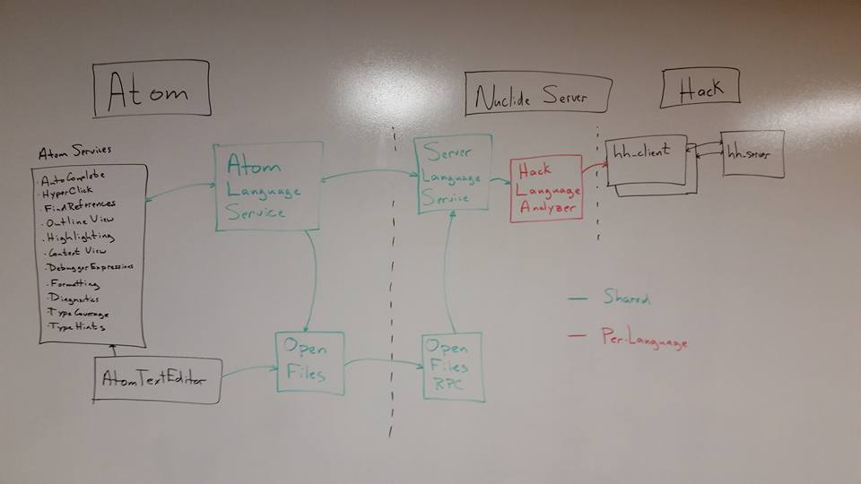

# Nuclide Language Service: Design

## Stage 1
### Goals
- Reduce cost of adding new languages
- Establish best practices
- Reduce per-keystroke RPC traffic

### Design

### File Synchronization

The `nuclide-open-files` package lives in the Atom process and synchronizes all open atom$TextBuffers
to its server process `nuclide-open-files-rpc`. The server version of atom$TextBuffer has the marker
and file synchronization code stripped out. In particular it no longer has a getPath() member.
This reduces dependencies on per-platform binaries.

When an Atom service wants to send a request to the Nuclide Server regarding the current contents of
a file it calls the `getFileVersionOfEditor` API from the `nuclide-open-files` package which
yields a `FileVersion` value. A `FileVersion` is just a filename and version number. Every time
an atom$TextBuffer is edited, its internal changecount(aka version number) is incremented.

A `FileVersion` value may be used in nuclide-rpc calls to the server. On the server a `FileVersion`
can be mapped back to an atom$TextBuffer via `getBufferAtVersion`. If a user is typing quickly,
a `FileVersion` may be outdated on the server by the time `getBufferAtVersion` is called. When this
occurs, `getBufferAtVersion` fails, and the calling operation can be safely aborted as the user's
request is outdated.

### AtomLanguageService

The `AtomLanguageService` class lives in the Atom process and handles all registration of Atom services including:
- autocomplete
- hyperclick
- find references
- outline view
- highlights
- definition Service
- debugger expressions
- formatting
- diagnostics
- type coverage
- type hints

The `AtomLanguageService` class takes a config object describing which language service features are
supported, as well as a factory which creates a `LanguageService` interface for a given RPC ServerConnection.

For each request from an Atom service, the `AtomLanguageService` uses the `getFileVersionOfEditor` in the
 `nuclide-open-files` package to get a `FileVersion` and forwards all requests to the
 `LanguageService` RPC interface on the server.

### ServerLanguageService

The `ServerLanguageService` implements the `LanguageService` RPC interface and lives in the
Nuclide Server process. It receives all calls from the `AtomLanguageService`, maps from `FileVersion`
back to NuclideUri and atom$TextBuffer using the `getBufferAtVersion` API from `nuclide-open-files-rpc`.
Then it forwards the request to the language specific `LanguageAnalyzer`. If the request is stale,
meaning the buffer is older than the requested version, then the request is aborted.

To implement a new language an implementation of the `LanguageAnalyzer` interface must be provided.
This interface does not need to be aware of the RPC layer or the file synchronization protocol.
All requests to the `LanguageAnalyzer` interface use atom$TextBuffers to communicate current editor
contents.

## Stage 2
### Goals
- enable analysis to reflect user's view of all open files
- enable instant diagnostics without saving
- Reduce per-keystroke traffic to language analyzer
- push based busy signal notifications

### Design

To achieve these goals, the language analyzer must be kept apprised of the current state of all open
files which can effect a language analysis operation. Rather than sending the contents of all edited
files on each operation, a persistent connection is established with the language analyzer and the
status of open files are proactively sent to the analyzer as the file is edited.

TODO Add Picture ...

### Observable File Events

The `nuclide-open-files-rpc` package also provides `observeFileEvents()` an observable stream of
file open/edit/close events. This is routed to the persistent language analyzer to keep it up to
date on all file edits.

Rather than sending the current file contents in each language analysis request, a file path and
version can be used for requests to the persistent connection.

Once the persistent connection is established, the language analyzer can push diagnostic updates
as soon as they are ready, rather than having the Nuclide code guess when to request diagnostics.
This enables significantly quicker diagnostic response, in particular for syntax errors.

- TODO: push based busy-signal
