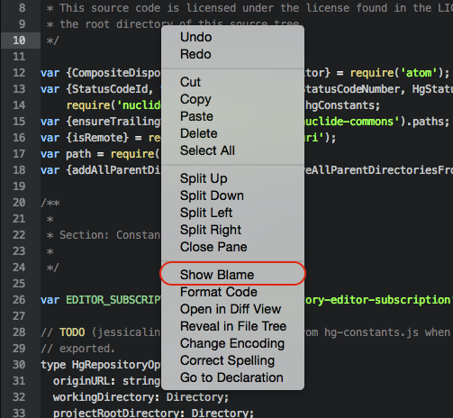

# nuclide-blame

Displays source control blame.


## Prerequisites

The `nuclide-blame` package requires at least two other packages to function: at
least one "blame provider" package that fetches blame information; and exactly
one "blame UI" package that consumes the information and displays it.

Nuclide currently provides the `nuclide-blame-provider-hg` package, which
can fetch blame for files within Mercurial repositories. To support other types
of source control, you would need other blame provider packages.

Nuclide also provides the `nuclide-blame-ui` package, which displays
blame information in a custom gutter on an editor.

## How to Use

To open blame, right-click in the body of an editor to open the context menu,
then select 'Show Blame'. 'Show Blame' will only be visible if you have a blame
provider package installed that can provide blame for the file in that editor.
To remove blame, open the context menu as above, and select 'Hide Blame'.



## How to Write a Blame Provider

See the `nuclide-blame-provider-hg` Atom package as an example. A blame provider
package should provide a service called "nuclide-blame-provider" through the Atom
service hub. This service should return a provider Object that implements the
following two methods:
```
canProvideBlameForEditor(editor: TextEditor) => boolean
```
and
```
getBlameForEditor(editor: TextEditor) => Promise<Map<number, string>>
```
where the keys of the Map are 0-indexed TextBuffer line numbers, and values are
blame.
