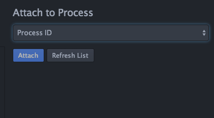
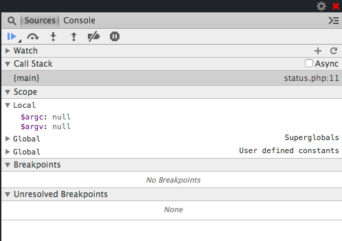
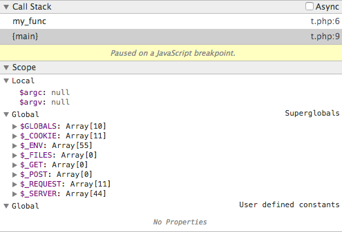
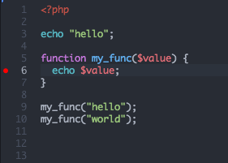
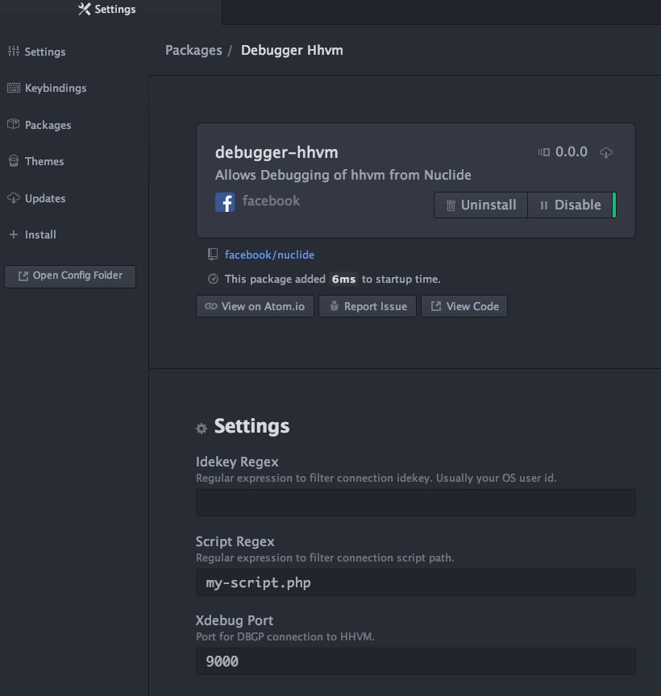

# HHVM Debugger

This package enables debugging HHVM processes on a remote machine.

## Setup

- Ensure HHVM is setup to enable XDebug(aka Dbgp) debugging.

For command line script debugging, you will need to create a `config.ini` file to enable xdebug debugging.
An example config file is:

    xdebug.enable = 1
    xdebug.remote_enable = 1
    xdebug.remote_autostart = 1
    xdebug.overload_var_dump = 0
    xdebug.remote_port = 9000

For server debugging, add the following to HHVM's config.hdl:

    Eval.Debugger {
      XDebugEnable = true
      XDebugDefaultEnable = true
      XDebugOverloadVarDump = 0
      XDebugRemoteEnable = true
      XDebugRemoteAutostart = true
    }

- Add the remote directory containing the PHP source code on your project using either:
 - `Packages - Connect...` menu.
 - Right click on the tree and click `Add Remote Project Folder`

## Attaching to your Debuggee

- Open the Attach UI with `Cmd - Shift - Y`
- Click on the `Process ID` drop down.

- Select the item showing `hhvm: your-remote-machine-name`

- Click `Attach` Button

You will see the Attach Waiting UI:

- Start the PHP script that you want to debug.

When running HHVM in server mode, load the URL of the script you want to debug in your web browser.
To debug a command line script, invoke HHVM with your config.ini and the script to be debugged:

    hhvm -c config.ini my-script.php

Upon starting the script, HHVM will connect to the Nuclide debugger. This may take a while - up to a minute or so.

On successful attach, the Attach Waiting UI will be replaced by the Debug UI. If the attach was unsuccessful you will be returned to the Attach to Process UI.

## Debugging

Once attached you will see the Debugger UI:

This UI may look familiar to you. It is the UI from Chrome's JavaScript debugger.

The features enabled for HHVM debugging include:

### Call Stack & Variable Display

Click on a stack frame to show the variables in scope at that frame:

Click on a scope or variable to examine values.

### Execution Control

Continue, Step Over/Into/Out are controlled by these buttons:

### BreakPoints  

Set breakpoints by clicking on the line number in the left side of your source window.
A line with a breakpoint will show a small red circle next to the line number.

### Ending a Debug Session

When the script being debugged has terminated the following message appears:

Click the red X at the top right of the Debug UI to terminate your debug session:

Restart the attach process to debug the script again.

### Coming Soon

- Display of class static variables
- Expression Evaluation
- Enhanced breakpoints
  - break on exception
  - conditional break points

## Filtering Debuggee Connections

By default, the debugger will attach to the first HHVM script which is run after beginning the
attach process. On a busy server, you may find that you accidentally attach to a monitoring
script before you can attach to your intended debuggee script.

You can control the script you attach to in the config settings of the debugger-hhvm package.

- Open the Settings page with `Cmd - ,`
- Select the `debugger-hhvm` package

Enter the name of the script you want to debug in the `Script Regex` field. This field accepts
any JavaScript regular expression. Clever regular expressions can be used to exclude scripts in
selected subdirectories.

Similarly the `Idekey Regex` can be used to filter debuggee connections by `idekey`. By
default HHVM sets the `idekey` to the unix username which started HHVM. The `idekey` used by HHVM can
be overriden by setting `xdebug.idekey` in the `config.ini` file specified when running HHVM.
Note that on many servers HHVM will be run by `root` so filtering by `idekey` may be unhelpful.

By default HHVM connects to debuggers on port 9000. This can be overriden with `xdebug.remote_port`
in your `config.ini`.

Note that `xdebug.idekey` and `xdebug.remote_port` may only be set in an `ini` file. They are
not configurable from the `hdl` config file format.
