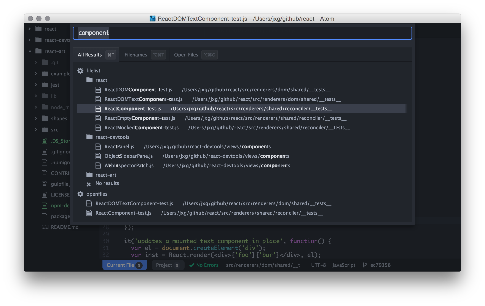

# nuclide-quick-open

This package provides a modal UI to quickly find both local and remote files.

The package enables fuzzy filename search, as well as searching the names of open files.
In addition, custom search providers can be supplied, such as providers for language-specific
symbol search or other, arbitrary services depending on which directories are mounted.

The primary quick-open UI is invoked via `cmd+t`, which shows a combined list of results from all
search providers, obtained asynchronously.

# Example

# Usage

The following key bindings are supported:

* `cmd+t`: All Results
* `cmd+opt+t`: Fuzzy file name results
* `cmd+opt+o`: Fuzzy file name search across open files

Nuclide also ships with these optional providers, where applicable:
* `cmd+opt+s`: Hack symbol search results

### Note: Why nuclide-quick-open overrides `cmd+t`

Nuclide-quick-open overrides the idiomatic `cmd+t` keybinding shared with Atom's
Fuzzy Finder package.

Fuzzy-finder functionality remains accessible via `cmd+p`, since the
`fuzzy-finder:toggle-file-finder` action has [two redundant keybindings](https://github.com/atom/fuzzy-finder/commit/4bc64b460299b0b6f7416d645fed79355f0b1665#diff-de068ccfe2bca7a3eaf241795d10f7bdR5).
