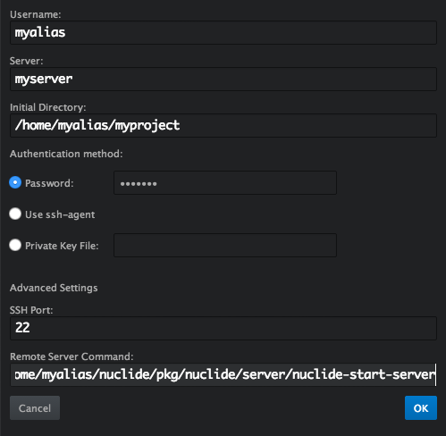

# nuclide-remote-projects

This package manages remote projects.

# Opening Remote Projects
You can initiate opening a remote project by either of the following methods.
1. "Add Remote Project Folder" from context menu of file tree.
2. "Connect..." command from Packages menu.

## Connect Dialog
You will be asked to specify connection parameters as shown below.

You can pick one of the three authentication methods in the dialog. If you have
`ssh-agent` set up for your remote server, you can select "Use ssh-agent". If you
have RSA key pair set up between your local machine and your remote server, you
can specify the file path to your private key.

**Caveat**: if your private key is encrypted, please add it to your ssh-agent by
calling `ssh-add` and select "Use ssh-agent".

Lastly, specify the remote server command to where it is installed to.
`nuclide-start-server` will pick an open port from a predefined list. If your
remote server has specific port that shall be used, you can append port number
to the command. For example,`nuclide-start-server -p 9090`

Upon submtting the connect dialog, Nuclide will try to establish an SSH connection
to your remote server, and run `nuclide-start-server` command to start Nuclide
server if it is not running.

# Security
Each Nuclide server instance generates key pair and client certificate for remote
connection. As part of SSH handshake, the client receives the private key and
certificate. The private key is encrypted and saved in Atom project state together
with the certificate. The encrypting key is stored in key store (such as key chain
on osx) by using [keytar](https://www.npmjs.com/package/keytar).
Using the certificate and private key, Nuclide client establishes a remote
connection over HTTPS or/and WSS (WebSockets over SSL/TLS) with remote server.

# Remote Projects
On top of the remote connection, Nuclide creates and adds a remote project in the
file tree. Remote projects will survive Nuclide reload and restart in that they will
appear in the file tree automatically. You can add multiple remote projects on the
same server. The current caveat is that you have to go through the SSH connection
again for a second remote project on the same remote server.

You can remove remote projects from the context menu of file tree. When you try to
remove the last remote project on a remote server, you will get prompted asking
whether you want to shutdown the Nuclide server on your remote server. Shutting down
the Nuclide server invalidates its certificates and keys.
